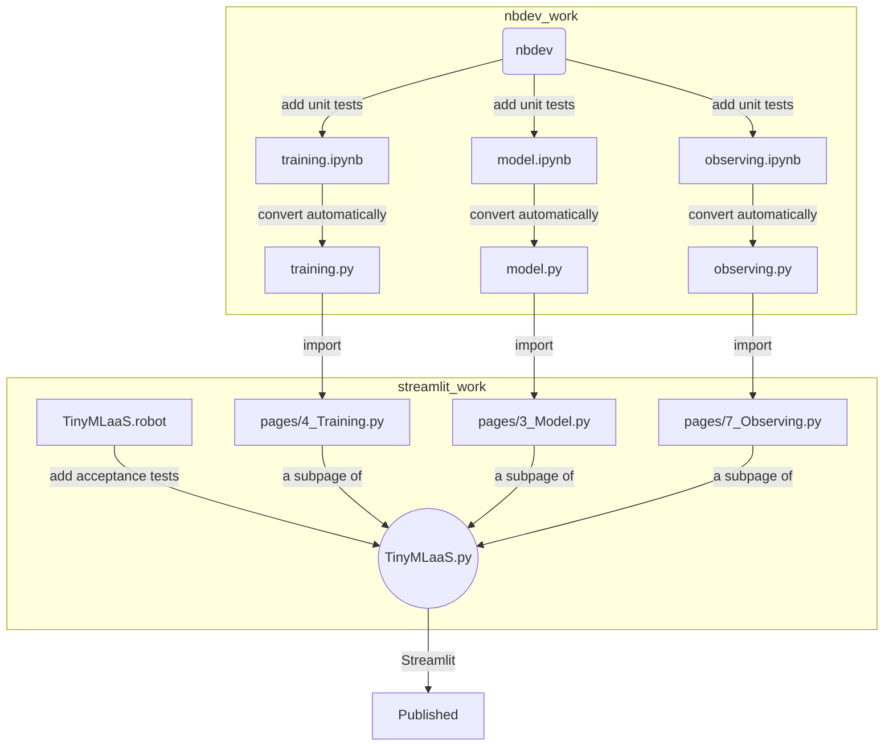
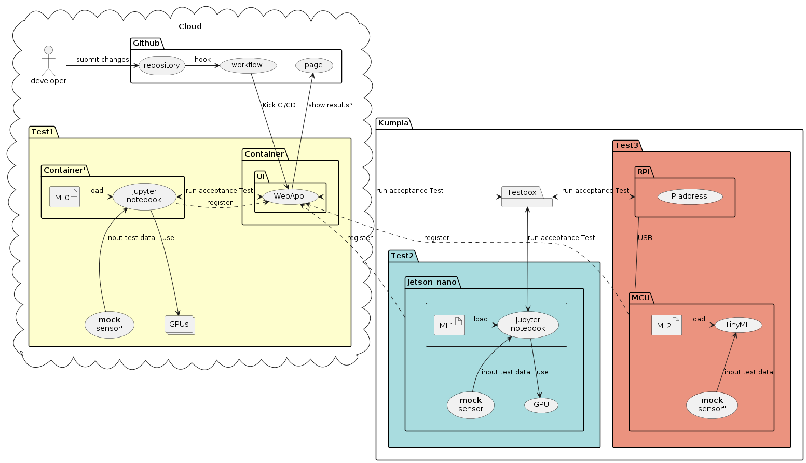

---
title: "Hello World of TensorFlow Lite for Microcontrollers"
---
Run [Hello World](https://github.com/tensorflow/tflite-micro/tree/main/tensorflow/lite/micro/examples/hello_world)
example of [TensorFlow Lite for Microcontrollers](https://www.tensorflow.org/lite/microcontrollers/get_started_low_level)
in Docker automatically, hooked in CI (Github workflow).

#  Sprint 1
We are adding `Observation` (Prediction) UI in WebApp (TinyMLaaS) with [streamlist](https://streamlit.io/).

0. `DevOps`, Install [nbdev](https://nbdev.fast.ai/) in this repo, to convert a Jupyter notebook to a .py file with unit tests.
1. `DevOps`, Add unit test [code coverage](https://forums.fast.ai/t/nbdev-code-coverage-n-tests/73993) for `*.ipynb` files.
   - Implement a failing unit test before implementing a feature.
   - Confirm an unit test is failing, and implement a feature itself.
2. `DevOps`, Add [acceptance test](https://blog.devgenius.io/testing-streamlit-a1f1fd48ce8f) (AT) with `TinyMLaaS.py`.
   - Implement a failing AT for BI before implement an BI itself.
   - Send a PR only for a failing AT at first, and we could agree on DoD (i.e. PR for a feature)
4. Put a WebApp and a Hello respectively in a container within `docker-compose`
5. A Hello container sends data to a WebApp container via simple TCP via [netcat](https://quickref.me/nc)
7. Observe & display Hello prediction on a WebApp at real time
9. `DevOps`, Dockerization, run by docker-compose
10. `DevOps`, Hook a PR in CI / CD with Github workflow
11. `DevOps`, Display the CI result on `Github page` via nbdev

### DoD
- A `PR merge` is DoD.
- Covert a BI to GH issues (i.e tasks you think needed)
- Each BI should have an acceptance criteria.
- Each acceptance criteria should be implemented as an acceptance test in robot framework.
- All acceptance test is triggered by any PR in CI.

## File structure

  

# Sprint 0
You'll implement the following "Test1".
You can skip training part for now. You need the following steps:

1. git clone <TensorFlow repo>
2. Follow hello world example instruction
3. Run make with appropriate parameter for standalone x86[*](https://www.tensorflow.org/lite/microcontrollers/library#generate_projects_for_other_platforms)
4. Build an executable binary with a model compiled in[*](https://github.com/ehirdoy/tflm)
5. Run an executable binary on x86[*](https://www.tensorflow.org/lite/microcontrollers/library#build_binaries)[*](https://asciinema.org/a/552162)
6. Put the above all in a container, reproducible with Docker file, inc all needed packages with "apt install" & "git clone <TensorFlow repo>" 
7. Add existing unit tests for this hello world[*](https://www.tensorflow.org/lite/microcontrollers/library#run_the_tests)
8. Add test code coverage measurement infrastructure (-gcov in gcc?)
9. Add a new acceptance test, How should we ensure this "Hello world"?
10 Add some dashboard of coverage on github page(?) if no way to present the coverage[*](https://quarto.org/docs/publishing/github-pages.html)
11. Hook a PR in CI / CD (github action / workflow) to run the above all

Please feel free to edit this document to share information with others correctly.

# Backlog?
1. A WebApp (TinyMLaaS) installs a TinyML Hello model in a Hello container  
2. Train "Hello world" with Jupyter notebook (JN) as instructed in TFLm website, recommended to all.
3. Convert the above training JN to a WebApp with streamlit
- Convert to a complete TinyML on a VM?  
- Try other ML model?
- Try real HW?
- Try remote CI / CD?
- Try better UI?

   
# User journey
https://miro.com/app/board/uXjVPwQdIjc=/

   
# Slides
- https://github.com/Origami-TinyML/software-engineering-project/blob/artifacts/kickoff.pdf
- https://github.com/Origami-TinyML/software-engineering-project/blob/artifacts/soft_eng_proj_tinyml_lifecycle.md
