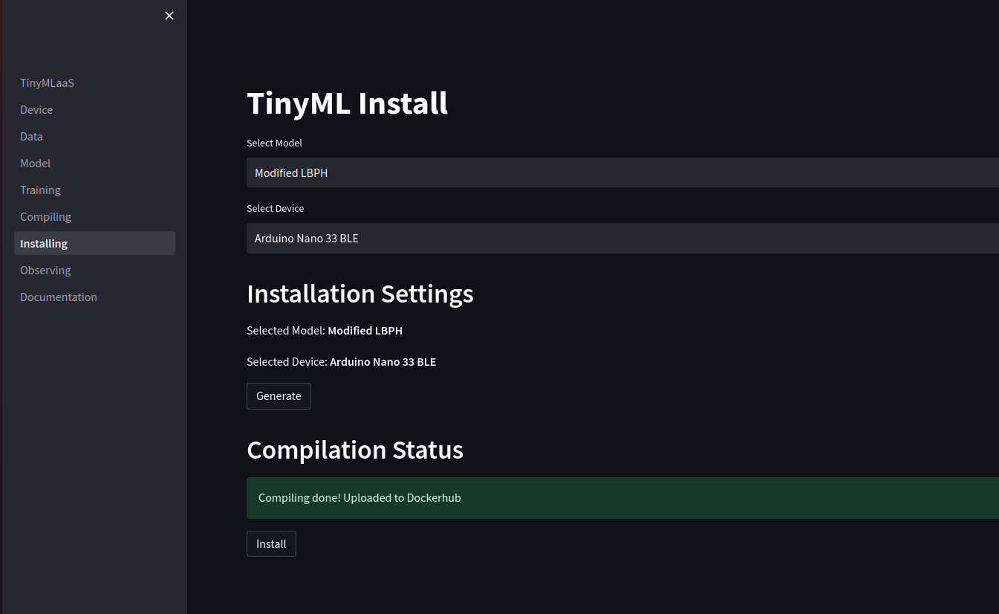
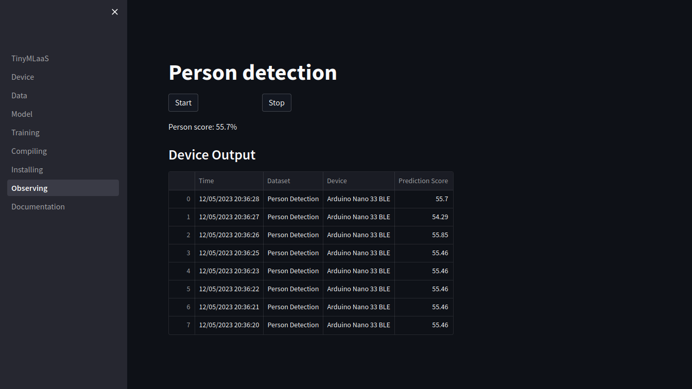

# Demonstratation of TinyMLaaS WebApp

This document will demonstrate the steps in TinyMLaaS app. Some pages have dependencies on other pages, so go through pages from top to bottom.

In order to run TinyMLaaS end-to-end following items needs to be run simultanously:
- Expose port 5000 for the bridging device to work with outside sources. (command: ngrok http 5000)
- Start up the bridging server. (command: python3 relay/main.py)
- Launch the app (command: make app)

Add the environment variables DOCKERHUB_USER and DOCKERHUB_PASSWORD in docker-compose.yml for Dockerhub (don't commit these changes).

## Device

On device page, user should open register a bridging device expander and add an IP address of the bridging server. 

Use the link from ngrok and wait until the app will confirm that a registration of the bridging server was successfull.

If IP address is not provided on this section, devices cannot be utilized in the later tabs.

## Data

First, select a dataset used for training of the model. 

Extracting images from archived file with localstack should take about 1-3min. This time should be reduced greatly when the datasets are actually stored in S3. After the app has confirmed the dataset has been uploaded, user is able to view images included the dataset. 

User can add images from local storage to selected dataset and label those. If the uploaded images are unlabeled they are not used for training in later stage of the process. However user can label those later if needed. 

Note that if you upload many images, streamlit's performance might reduce. Also, images added to dataset is available only for this session, the app doesn't support saving new images to datasets permanently. 

## Model

For now the app supports only one model and therefore, this tab has been filled with dummy data. Changing selections on this tab doesn't impact to the model. 

To continue press Select button.

## Training

Before training the Keras model, model training settings need to be defined. A user need to enter information regarding number of epocs, batch size, image width and image height. The current model can be only trained if image width and image height are same and if loss function is Sparse Categorical.

Here are example inputs for training a model.

Press Train to continue.

## Compiling

The page is responsible for ML compilation. This page is also filled with dummy data, so selections won't impact on compiling result. 

Press Compile to continue.

## Installing

On the installing sheet, user must select a model and a device. Like stated before, app supports one model and two devices.

The user must have plugged the device into the USB-port before building the docker image. It is good to check that the device is plugged into correct port, since plugging into incorrect port creates an error. If build time seems to be unexpectedly long, it might be good idea to check there is no 'No device found on ttyACM0' warning when running the relay server. That means the commands used to communicate with a device require sudo rights. This can be easily fixed by altering device commands in the relay/main.py module.

The building time varies depending on the device. The Arduino nano 33 BLE takes about 10-15min and Pico 5-10min to install. After building, a model is ready to be sent to the device.

To continue, user must first press Generate button (builds the docker image and upload it to dockerhub) and when that has been finalized user press Install button (installs the model on to the device using the docker image downloaded from dockerhub). If user wants to change the device, whole page needs to be rerun with new device.

## Observing

On the observing page, user can see real-time predictions from device when the start button has been activated. A plugged device sends approximately every second a prediction. Notice that with current model and camera the predictions are not very accurate. User can end printing new predictions to the app by pressing stop button.

