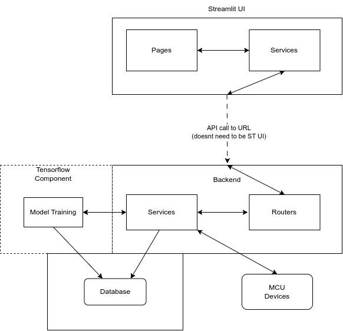

# Architecture Guide

This page contains general information about the architechture and how each component is related to each other.

## Block Diagram

The backend is the main component that deals with calling the tensorflow functions and communicating with the MCU devices. Tensorflow is currently the supported UI but you can also make API calls directly or use the CLI. In the future the tensorflow components can be containarized as their own service.

